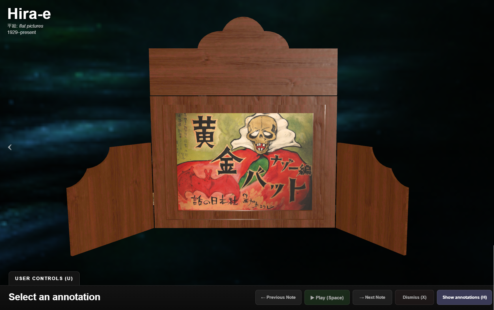

# [Explore Kamishibai Models](https://3d-kamishibai-models.vercel.app)
**3D Kamishibai Models** is an interactive 3D exhibit that allows visitors to explore reconstructed examples of two historical forms of Japanese paper theatre: **tachi-e** (立ち絵, “standing pictures”) and **hira-e** (平絵, “flat pictures”). Rather than presenting these forms as static objects, the viewer recreates their mechanisms of operation, allowing visitors interact with elements essential for these media. Paper figures or illustrated cards can be manipulated and animated during interaction.

The models incorporates modular elements, divided by the **numbered markers**. Selecting a marker opens a short explanatory note and automatically adjusts the camera to an appropriate viewing position. Additionally, most of the models store an animation, which the user can trigger by clicking or pressing **Play**.

The exhibits can be explored in two ways: following the markers via User Control panel (or keyboard) will guarantee a guided experience, walking the user step by step. Optionally, the users can interact with any desired element in any order, by hovering & clicking. At all times, the users can manually orbit around the reconstructed stages, zoom in on individual elements, and inspect the elements in context. 

The **tachi-e** exhibit focuses on the small, manually operated paper puppets used in early forms of paper theatre. It includes reconstructed examples of two-state figures, modular puppets, stationary stage elements, and mechanisms associated with theatrical transformations. 

The **hira-e** exhibit presents a later configuration that uses larger, flat picture cards. The model demonstrates how the slideshow mechanism works from audience and performer perspective. The user can choose the slide sets from a small catalogue.

The viewer is designed as an **educational reconstruction rather than a general-purpose 3D model viewer**. The models, animations, and interactions are intended to make otherwise invisible aspects of these cultural forms, material or performative. The contrast between two models showcases the evolution of the form, its modalities and performative strengths.

The exhibit forms part of the broader **Media Phylogeny** research project, which investigates how media forms emerge through the adaptation, recombination, and transformation of existing technologies and cultural practices.
