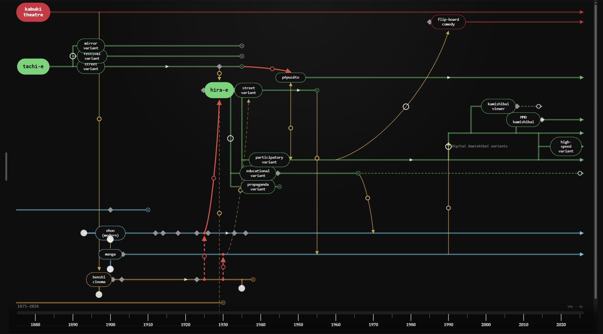

# [Explore the Media Phylogeny](https://media-phylogeny-diagram.vercel.app)

**Media Phylogeny Diagram** is an interactive diagram for visualizing how communication media emerge, overlap, transform, and influence one another across time. Rather than presenting media history as a simple chain of inventions and successors, the diagram maps a more complex ecology of relationships: media can descend from earlier forms, borrow formal characteristics from distant relatives, transfer techniques between cultural contexts, or develop along parallel trajectories.

The diagram is centred on the emergence of two forms of kamishibai: **hira-e** and **tachi-e**. However, it is designed to be explored incrementally rather than read from beginning to end. Crucial media nodes include a **details panel**, allowing users to read micro-articles about significant storytelling media. These entries describe their histories and include supporting graphics and sources.

The diagram itself is interactive. Users can progressively uncover the convoluted network of relationships that emerges from interactions between different media formats and intersections between different cultures. Collapsible branches allow users to investigate the extended origins and lineages of particular media while keeping the overall diagram readable.

Not all connections mean the same thing. **Structural lines** indicate forms that are connected within a lineage, following a logic similar to that of a biological phylogeny diagram. Between these growing branches, two other types of connections can be found. **Descent and transmediation lines** (red) indicate a strong medial and formal relationship that contributed to the development of a new medium, comparable to speciation in biological evolution. **Formal connections** (yellow) indicate less consequential shared or borrowed characteristics that may occur at different points throughout a medium's lifespan. Both types of connections can be understood as roughly analogous to horizontal gene transfer in phylogenetics, representing relationships that cut across established lineages.

The result is not intended to be a definitive “tree” of media history. It is an **explorable map of medial relationships**—a way of seeing historical media as interconnected forms that continually adapt, recombine, compete, and reappear within changing cultural and technological environments.

